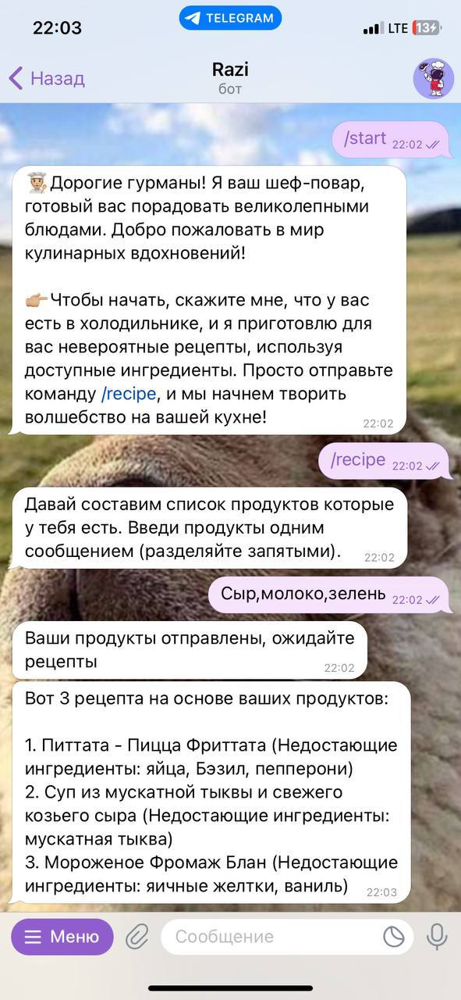

# Телеграм бот состовляющий рецепты из продуктов в вашем холодильнике

---

### О проекте
Данный проект нацелен составления рецептов блюд на основе имеющихся продуктов

---

### Запуск бота
В проекте использовалась библиотека aiogram и пакетный менеджер для python *poetry*
Запуск *Бота* осуществляется командой:
> __poetry run razi_start__ 

### Запуск API для составления рецептов
Запуск *API* осуществляется командой:
> __poetry run python api__ 

### Связь бота и api
Для связи бота и api был выбран борокер сообщений RabbitMQ. Для работы с очередями в боте используется aio-pika, а для api просто pika

Как установить RabbitMQ -> https://www.rabbitmq.com/download.html

---

